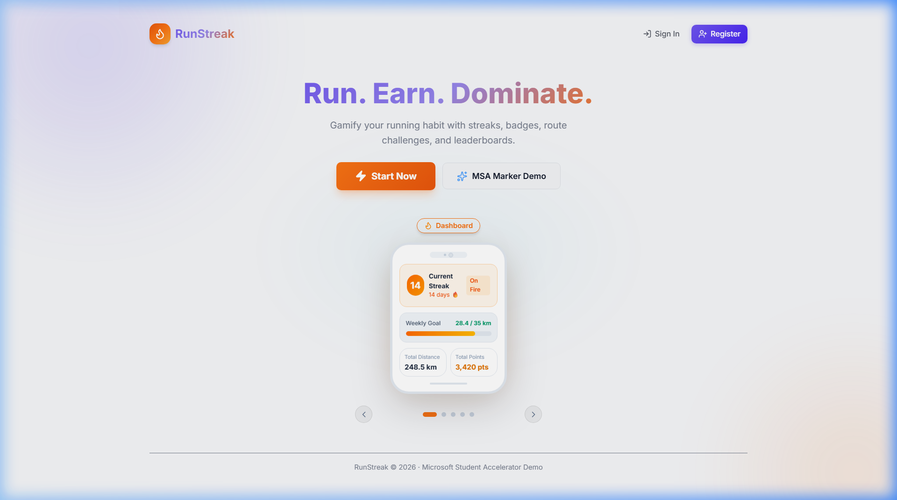
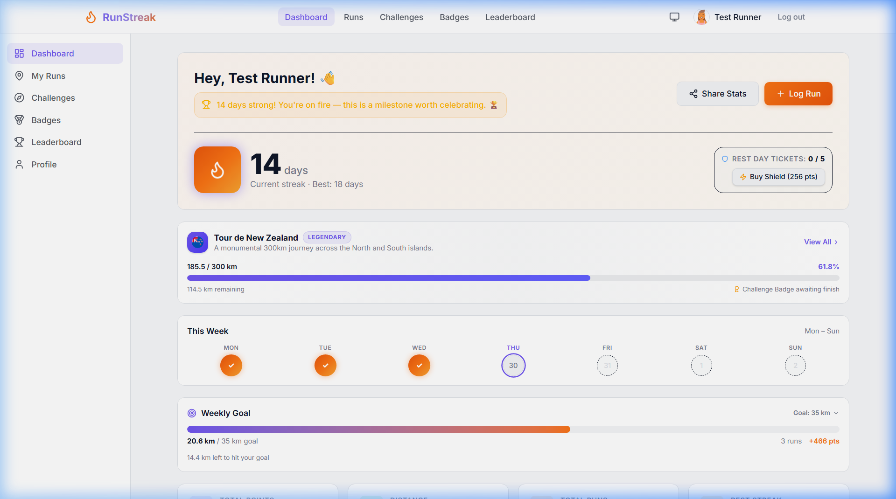
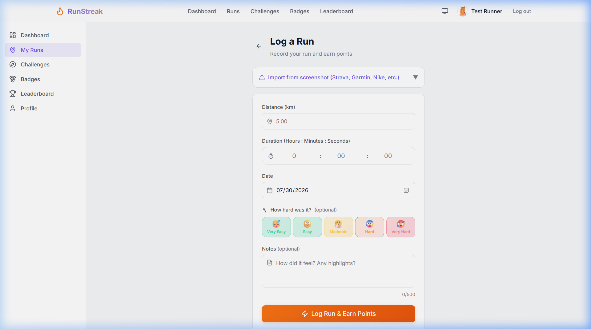
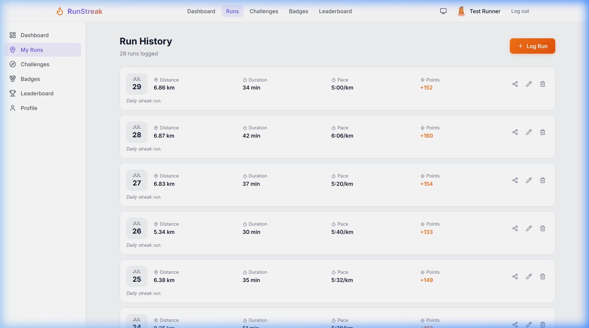
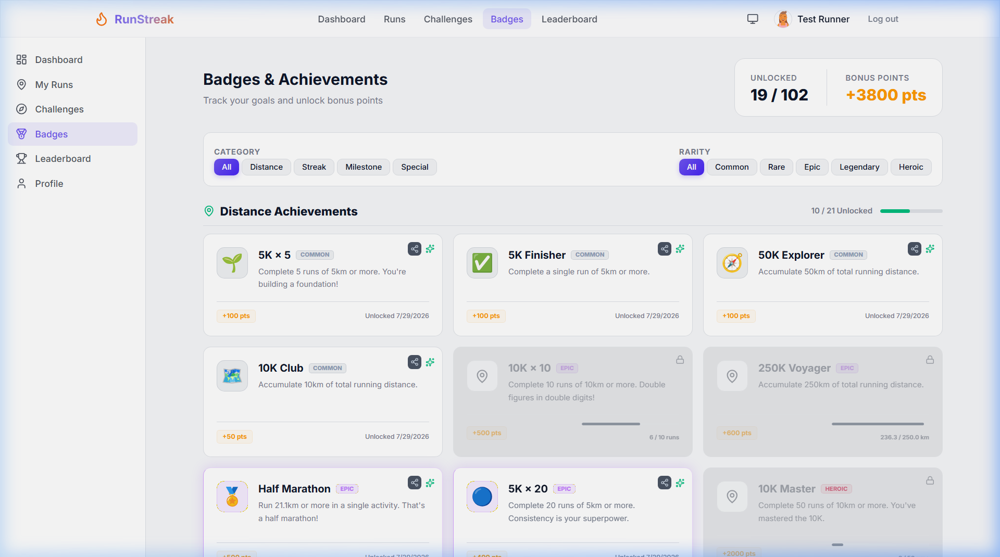
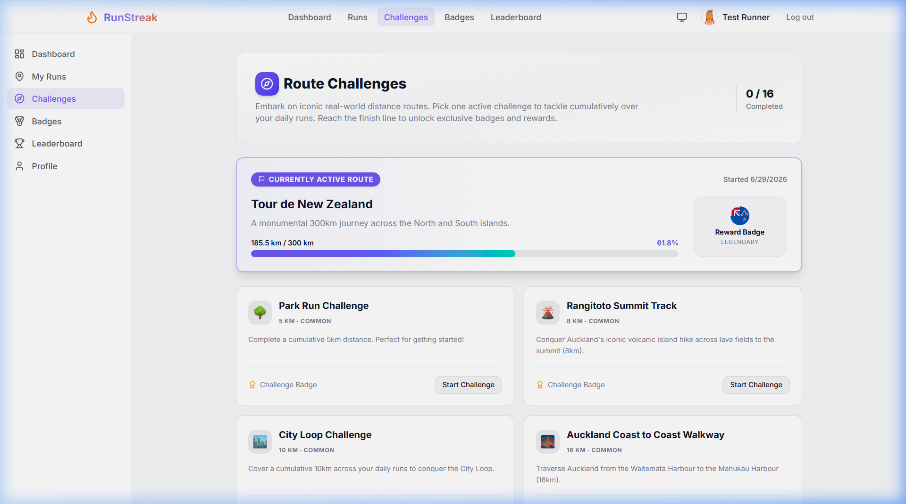
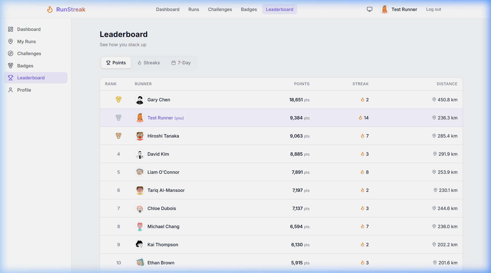
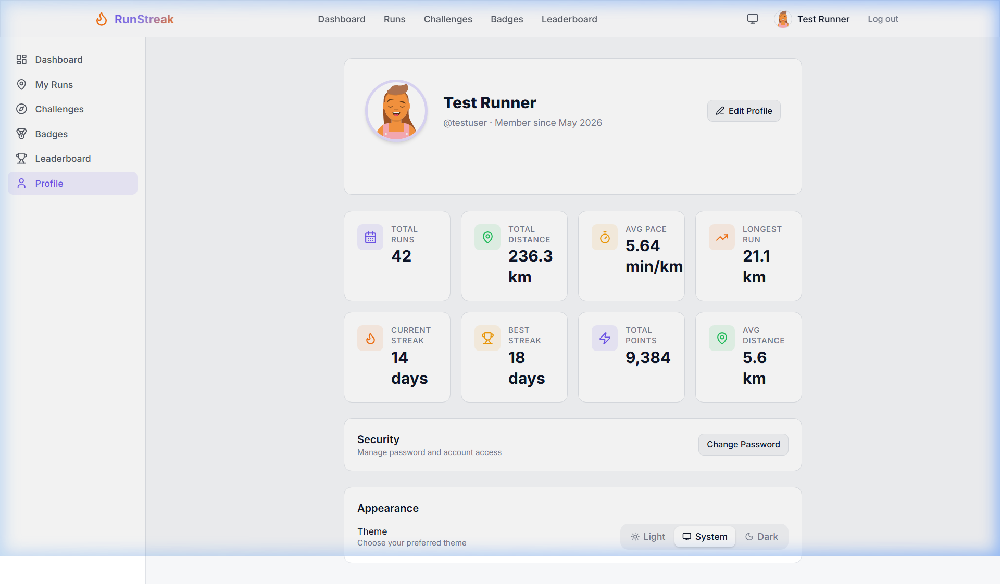

# RunStreak — User Manual & Feature Showcase

Welcome to **RunStreak**, a full-stack gamified running habit builder designed to turn daily physical activity into an engaging, rewarding experience. This guide will walk you through the key features, interfaces, and gamification mechanics of the RunStreak application.

---

## Table of Contents

1. [Landing Page & Authentication](#1-landing-page--authentication)
2. [Dashboard & Habit Tracker](#2-dashboard--habit-tracker)
3. [Logging a Run & AI Screenshot Import](#3-logging-a-run--ai-screenshot-import)
4. [Run History & Performance Analysis](#4-run-history--performance-analysis)
5. [Badges & Achievement System](#5-badges--achievement-system)
6. [Real-World Route Challenges](#6-real-world-route-challenges)
7. [Global & Rolling Leaderboards](#7-global--rolling-leaderboards)
8. [User Profile, Avatars & Theme Switching](#8-user-profile-avatars--theme-switching)

---

## 1. Landing Page & Authentication

The landing page features a modern glassmorphic UI, animated background gradients, and an interactive showcase of the app's primary features.

### Key Features:
- **Registration Flow:** Sign up with email verification (6-digit code sent via Resend API).
- **Secure Authentication:** JWT Bearer authentication with short-lived in-memory access tokens and auto-rotated refresh tokens in `localStorage`.
- **Demo Account Quick Access:** Click the **⚡ Auto-fill** button on the sign-in modal to immediately populate the preset `testuser` account credentials (`testuser` / `Test1234!`). Includes a **Quick Reset** button to restore state on shared environments.

---

## 2. Dashboard & Habit Tracker

The Dashboard acts as your central command center, offering instant feedback on your current running momentum, personal records, and active route challenges.

### Key Showcase Components:
- **Active Streak Counter:** Displays your consecutive running days with dynamic flame styling (`🔥 14-Day Streak`).
- **Rest Day Tickets (Streak Freezes):** Protect your hard-earned streak on rest days. Tickets automatically apply or can be manually managed.
- **Weekly Progress & Insights:** Interactive calendar strip (Mon–Sun) showing your weekly distance goal, progress bar, and contextual motivational tips.
- **Personal Records (PBs):** Highlights your longest run, best average pace, and best week distance ever.
- **Active Route Spotlight:** Quick access to your currently selected real-world distance route.

---

## 3. Logging a Run & AI Screenshot Import

Log your runs manually or upload a screenshot from Strava, Garmin, or Nike Run Club using our AI-powered multimodal import tool.

### Features & Workflow:
- **Manual Entry:** Specify distance (km), duration (hours, minutes, seconds), run date, and notes.
- **5-Level Effort Rating (RPE):** Select from *Very Easy (1)* to *Very Hard (5)* to track workout intensity.
- **AI Screenshot OCR Import:** Upload a running app screenshot to auto-extract distance, duration, date, pace, and calories via Gemini AI.
- **Pace Preview:** Live pace calculation formatted in runner-friendly `M:SS /km` notation.

---

## 4. Run History & Performance Analysis

View and manage all your past activities in a comprehensive, sortable log.

### Features:
- **Detailed Run Cards:** Shows distance, formatted pace (`M:SS /km`), total time, perceived exertion badge, and earned points.
- **Sort & Filter:** Sort activities by date, distance, or duration.
- **Run Management:** Edit or delete logged runs with real-time recalculation of total points and streak statuses.

---

## 5. Badges & Achievement System

RunStreak incorporates a 48-badge progression engine split across Distance, Streak, Milestone, Special, and Challenge categories.

### Gamification Mechanics:
- **Rarity Tiers:** Badges are ranked by rarity (*Common, Rare, Epic, Legendary, Heroic*) with corresponding border glows and background themes.
- **Unlock Progress:** Locked badges feature progress bars showing exact requirements needed for unlock (e.g. `14 / 20 runs`).
- **Celebration Overlay & Shareable Cards:** Unlocking a badge triggers a full-screen celebration with confetti. Unlocked badges can be exported into shareable social brag cards featuring QR codes.

---

## 6. Real-World Route Challenges

Embark on famous real-world distance routes and complete them cumulatively across your daily runs.

### Features:
- **Iconic Routes:** Choose from 16 real-world trails, such as the *Rangitoto Summit Track (8km)*, *Milford Track (53.5km)*, *Tongariro Crossing (150km)*, or *Te Araroa Trail (3,000km)*.
- **Repeatable Challenges & Tiered Badges:** Complete challenges multiple times (1×, 3×, 5×, 10×) to earn **Bronze, Silver, Gold, and Diamond** tier badges.
- **Active Route Switching:** Flexibly pause and switch active challenges without losing cumulative progress.

---

## 7. Global & Rolling Leaderboards

Compete against other runners on the community leaderboards or track your performance against your past self.

### Features:
- **Multiple Ranking Modes:** Toggle between Total Points ranking and Current Streak ranking.
- **Rolling 7-Day View:** Compare recent activity fairly regardless of user join date.
- **User Spotlight:** Your position is highlighted in the list for quick tracking.

---

## 8. User Profile, Avatars & Theme Switching

Personalize your runner experience and manage security settings.

### Personalization Options:
- **DiceBear Avatar Generator:** Select from 14 unique avatar styles (Notionists, Lorelei, Avataaars, Pixel Art, etc.) with custom seed inputs.
- **Theme Switching:** Instantly switch between Light and Dark mode with smooth color transitions. Preference is saved automatically in `localStorage`.
- **Security & Password Management:** Update your account details and password securely.

---

*Thank you for using RunStreak! Keep running and building your streak!* 🏃✨
