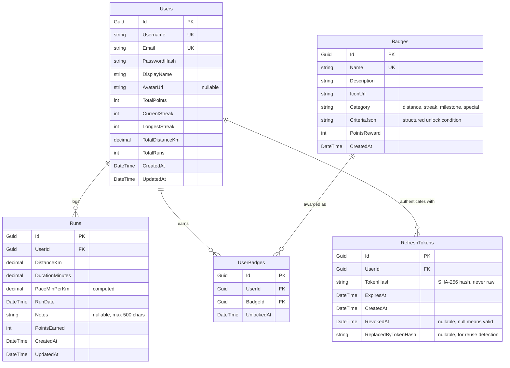

# RunStreak — Data Model

> Last updated: 2026-06-22
> Status: Draft — to be finalized during Phase 1A implementation

## Entity Relationship Diagram



## Entity Details

### Users

The central entity. Stores both auth credentials and denormalized gamification stats for fast leaderboard queries.

| Column | Type | Constraints | Notes |
|--------|------|-------------|-------|
| Id | Guid | PK | Generated server-side |
| Username | string(50) | Unique, Required | Display identifier |
| Email | string(256) | Unique, Required | Login credential |
| PasswordHash | string | Required | Hashed via `PasswordHasher<User>`, never raw |
| DisplayName | string(100) | Required | Shown on leaderboard / profile |
| AvatarUrl | string(512) | Nullable | URL to avatar image |
| TotalPoints | int | Default 0 | Denormalized sum of all run points |
| CurrentStreak | int | Default 0 | Consecutive days with a run |
| LongestStreak | int | Default 0 | All-time best streak |
| TotalDistanceKm | decimal(10,2) | Default 0 | Denormalized sum |
| TotalRuns | int | Default 0 | Denormalized count |
| CreatedAt | DateTime | Required | UTC |
| UpdatedAt | DateTime | Required | UTC, updated on any profile/stat change |

**Why denormalize stats?** The leaderboard needs to sort all users by points or streak. Computing these on-the-fly from the Runs table for every leaderboard query is expensive. Denormalized columns allow a simple `ORDER BY TotalPoints DESC` with an index. The tradeoff is maintaining consistency during run CRUD — the service layer recalculates after every insert/update/delete.

### Runs

A single running activity logged by a user.

| Column | Type | Constraints | Notes |
|--------|------|-------------|-------|
| Id | Guid | PK | |
| UserId | Guid | FK → Users, Required | Cascade delete |
| DistanceKm | decimal(8,2) | Required, > 0 | Validated: must be positive |
| DurationMinutes | decimal(8,2) | Required, > 0 | Validated: must be positive |
| PaceMinPerKm | decimal(8,2) | Computed | = DurationMinutes / DistanceKm |
| RunDate | DateTime | Required | Validated: not in the future |
| Notes | string(500) | Nullable | Optional user notes |
| PointsEarned | int | Required, ≥ 0 | Calculated by PointsService on creation |
| CreatedAt | DateTime | Required | UTC |
| UpdatedAt | DateTime | Required | UTC |

### Badges

Achievement definitions. Seeded once, rarely changed. The `CriteriaJson` column stores the unlock condition in a structured format so the badge engine can evaluate it programmatically.

| Column | Type | Constraints | Notes |
|--------|------|-------------|-------|
| Id | Guid | PK | |
| Name | string(100) | Unique, Required | e.g. "First Steps" |
| Description | string(500) | Required | e.g. "Log your first run" |
| IconUrl | string(512) | Required | Badge icon asset URL |
| Category | string(50) | Required | One of: distance, streak, milestone, special |
| CriteriaJson | string | Required | JSON, e.g. `{"type":"total_runs","threshold":1}` |
| PointsReward | int | Required, ≥ 0 | Bonus points on unlock |
| CreatedAt | DateTime | Required | UTC |

**Example badge criteria:**

```json
// First Steps — log your first run
{ "type": "total_runs", "threshold": 1 }

// Marathon Runner — 42.2km in a single run
{ "type": "single_run_distance_km", "threshold": 42.2 }

// Week Warrior — 7-day streak
{ "type": "current_streak", "threshold": 7 }

// Century Club — 100km total distance
{ "type": "total_distance_km", "threshold": 100 }

// Speed Demon — pace under 5 min/km on a 5km+ run
{ "type": "pace_under", "pace_threshold": 5.0, "min_distance_km": 5.0 }
```

### UserBadges

Junction table linking users to their unlocked badges.

| Column | Type | Constraints | Notes |
|--------|------|-------------|-------|
| Id | Guid | PK | |
| UserId | Guid | FK → Users, Required | Cascade delete |
| BadgeId | Guid | FK → Badges, Required | |
| UnlockedAt | DateTime | Required | UTC, when the badge was earned |

**Unique constraint:** `(UserId, BadgeId)` — a user can only earn each badge once.

### RefreshTokens

Stores hashed refresh tokens for the split-storage JWT auth flow. See `specs/decisions/001-split-storage-jwt.md` for the full rationale.

| Column | Type | Constraints | Notes |
|--------|------|-------------|-------|
| Id | Guid | PK | |
| UserId | Guid | FK → Users, Required | Cascade delete |
| TokenHash | string | Required | SHA-256 hash of the raw token |
| ExpiresAt | DateTime | Required | UTC |
| CreatedAt | DateTime | Required | UTC |
| RevokedAt | DateTime? | Nullable | null = still valid; set on rotation or logout |
| ReplacedByTokenHash | string? | Nullable | Hash of the replacement token; enables reuse detection |

**Token rotation:** When a refresh is performed, the old token's `RevokedAt` is set and `ReplacedByTokenHash` points to the new token's hash. If a revoked token is ever presented again, it indicates potential token theft — the server should revoke the entire token family for that user.

## Indexes

| Table | Column(s) | Type | Rationale |
|-------|-----------|------|-----------|
| Users | Email | Unique | Login lookup |
| Users | Username | Unique | Display uniqueness |
| Users | TotalPoints | Non-unique, DESC | Leaderboard sort |
| Users | CurrentStreak | Non-unique, DESC | Streak leaderboard sort |
| Runs | UserId, RunDate | Composite | Streak calculation, user run history |
| Runs | RunDate | Non-unique, DESC | Global recent runs |
| UserBadges | UserId, BadgeId | Unique composite | Prevent duplicate badge awards |
| RefreshTokens | TokenHash | Unique | Token lookup on refresh |
| RefreshTokens | UserId | Non-unique | Revoke all tokens for a user on logout |

## Seed Data — Initial Badges

The following badges will be seeded on first migration / app startup:

| Name | Category | Criteria | Points |
|------|----------|----------|--------|
| First Steps | milestone | `total_runs >= 1` | 50 |
| Getting Started | milestone | `total_runs >= 5` | 100 |
| Dedicated Runner | milestone | `total_runs >= 25` | 250 |
| Centurion | milestone | `total_runs >= 100` | 500 |
| 5K Club | distance | `single_run_distance_km >= 5` | 100 |
| 10K Club | distance | `single_run_distance_km >= 10` | 200 |
| Half Marathon | distance | `single_run_distance_km >= 21.1` | 500 |
| Marathon | distance | `single_run_distance_km >= 42.2` | 1000 |
| Week Warrior | streak | `current_streak >= 7` | 200 |
| Fortnight Force | streak | `current_streak >= 14` | 400 |
| Monthly Master | streak | `current_streak >= 30` | 1000 |
| Century Club | distance | `total_distance_km >= 100` | 500 |
| 500K Explorer | distance | `total_distance_km >= 500` | 1000 |
| Speed Demon | special | `pace < 5.0 AND distance >= 5km` | 300 |
